# Manual Técnico

Se desarrolló una topología de una red para un pequeño negocio de dos niveles, la topología es de tipo estrella uniendo los switches entre los niveles, donde cada switch está a cargo de un nivel.

# Práctica 1

## Requisitos

Para poder desarrollar esta práctica y para realizar modificaciones futuras es necesaria la instalación de los siguientes recursos:

1. Cisco Packet Tracer 
    - Para simular las vpc y el envío de paquetes.

## Configuracion de las VPCs:

1. Gerencia:

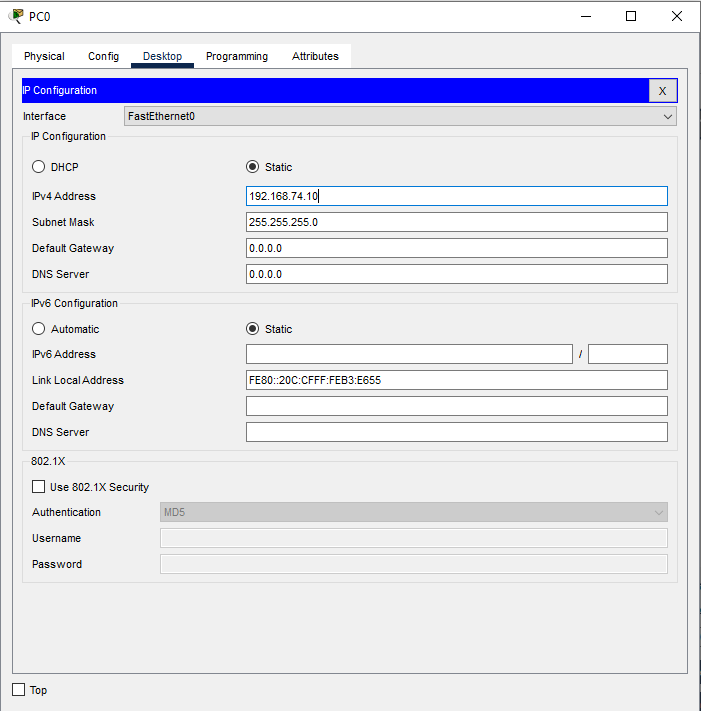

2. Administración:

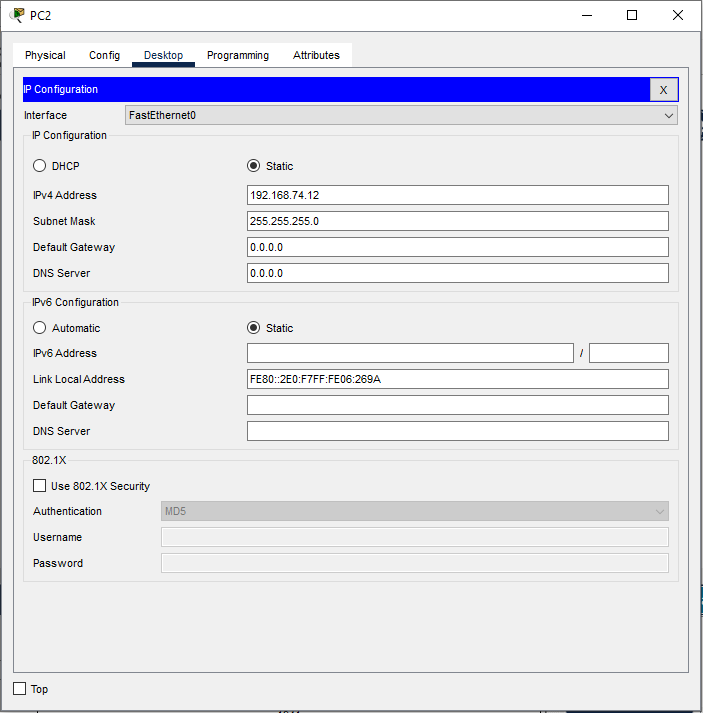

3. Atención al Cliente

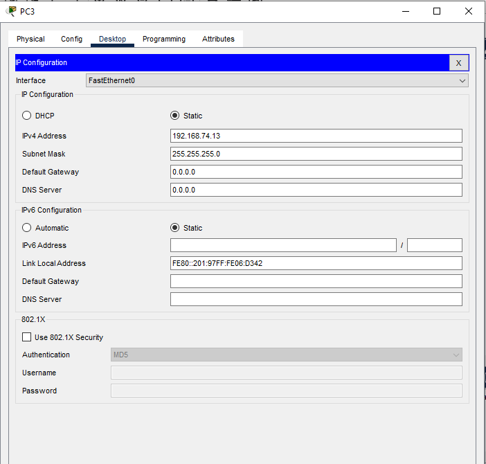

4. Recursos Humanos

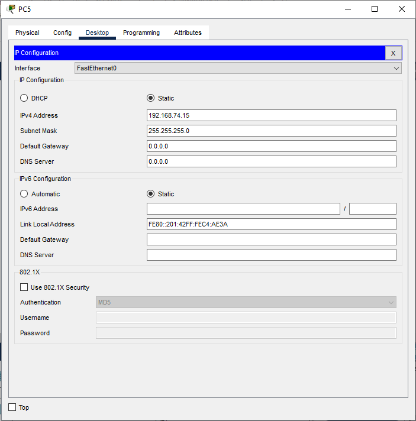

5. Oficina A

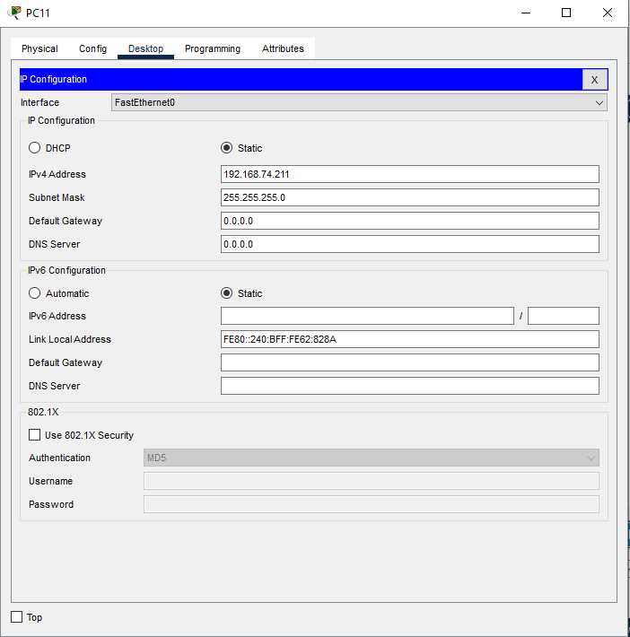

6. Oficina B

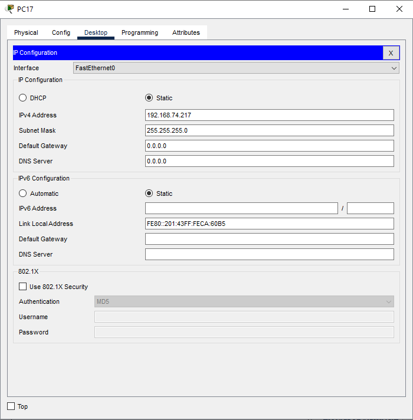

7. Oficina C

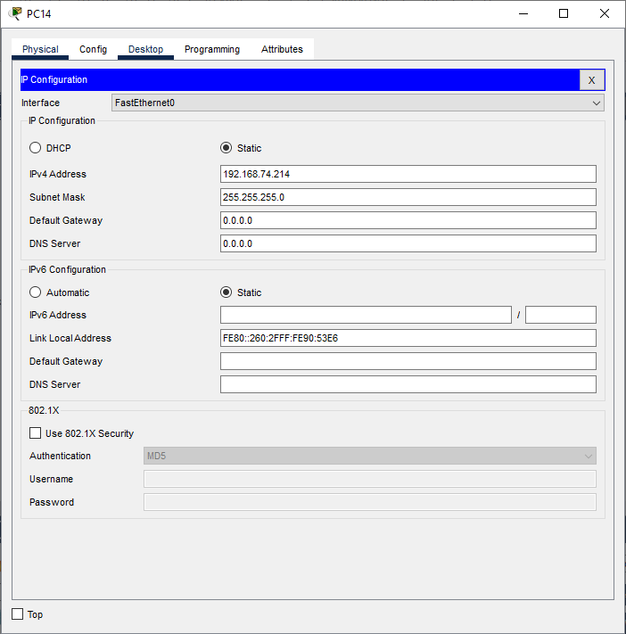

## Pings

1. Gerencia - RRHH

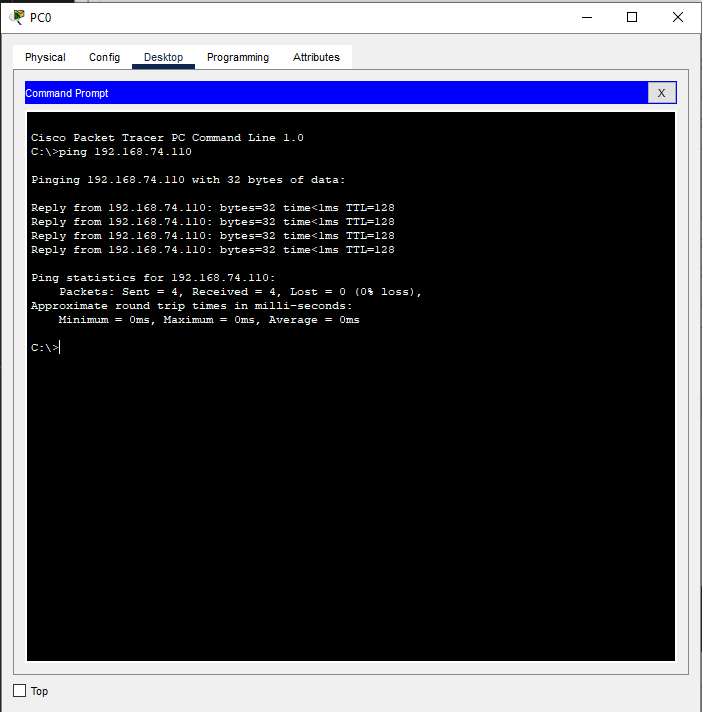

2. RRHH - Oficina A

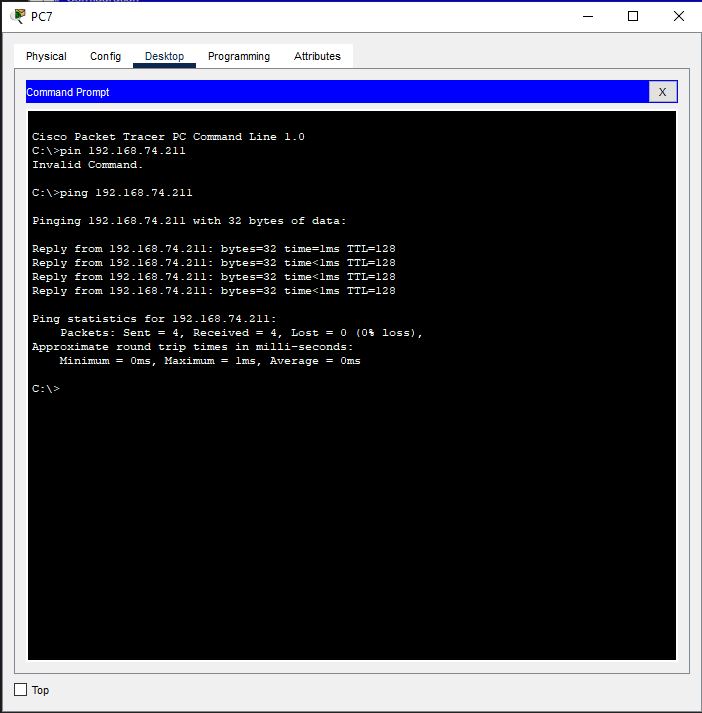

3. Oficina C - Atención al Cliente

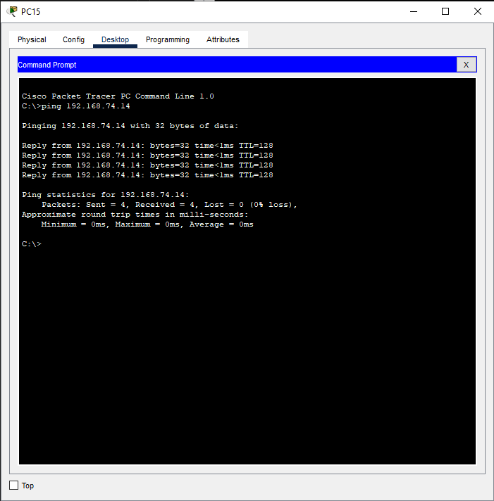

## Captura de paquetes ARP/ICMP

Demostración de captura de paquetes:

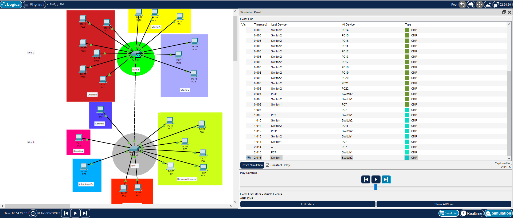

## Topología final:

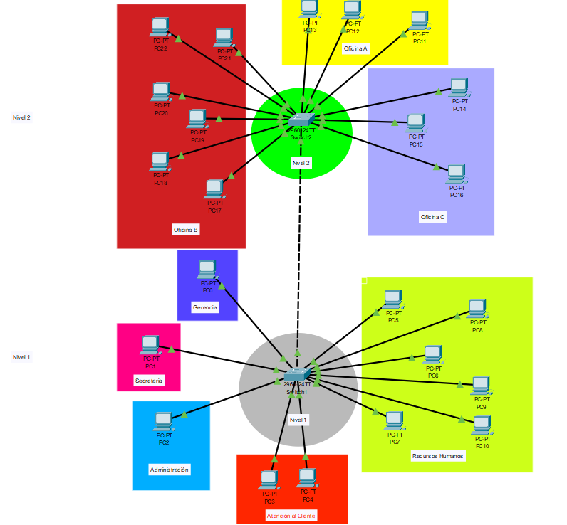