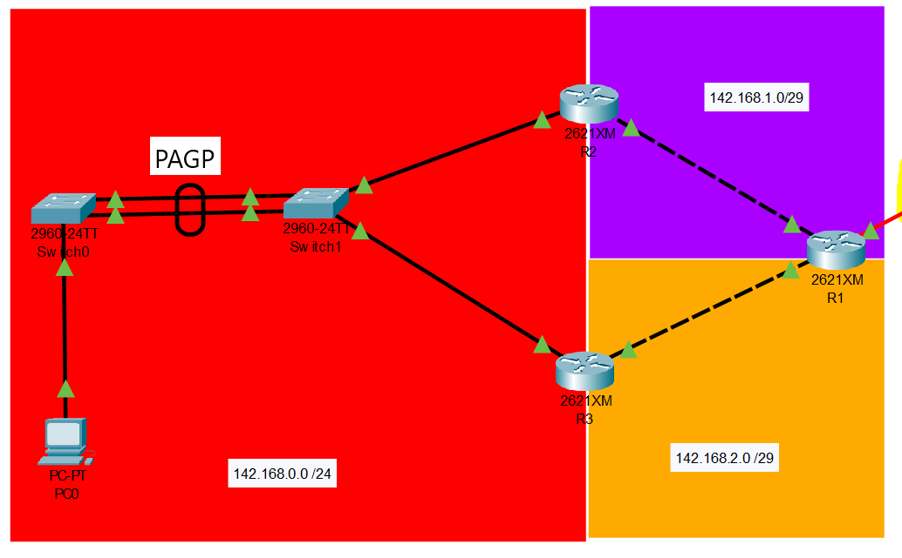

# PRACTICA 2

Se creó una topología de red reducida, que simula las interacciones entre redes conectadas por routers, por lo que se implementó un ruteo estatico entre routers  para comunicar las redes, asi como la configuración de HSRP y puentes PAGP y LACP.

# TOPOLOGÍA

La red propuesta consta de siete redes:

* 142.168.0.0 /24.
* 142.168.1.0 /29.
* 142.168.2.0 /29.
* 10.0.0.0 /30.
* 142.178.0.0 /24.
* 142.178.1.0 /29.
* 142.178.2.0 /29.

## 1. Configuracion de Routers

### R1

Para el router 1 fue necesario agregar un puerto serial utilizando el modulo WIC-1T:

#### Comandos utilizados:

    //Configuracion de nombre de host
    enable
    configure terminal
    hostname R1

    //Configuracion de ip a interfaces
    int se0/0
    ip add 10.0.0.1 255.255.255.252
    no shutdown
    exit

    int fa0/0
    ip add 142.168.1.2 255.255.255.248
    no shutdown

    int fa0/1
    ip add 142.168.2.2 255.255.255.248
    no shutdown

    do w

    //Configuración de rutas estaticas a interfaces
    enable
    conf t
    ip route 142.168.0.0 255.255.255.0 142.168.1.1
    ip route 142.168.0.0 255.255.255.0 142.168.2.1
    ip route 142.168.1.0 255.255.255.248 142.168.1.1
    ip route 142.168.2.0 255.255.255.248 142.168.2.1
    ip route 10.0.0.0 255.255.255.252 10.0.0.2
    ip route 142.178.1.0 255.255.255.248 10.0.0.2
    ip route 142.178.2.0 255.255.255.248 10.0.0.2
    ip route 142.178.0.0 255.255.255.0 10.0.0.2
    do w

### R2
    Se configuró HSRP en este router y el R3 para evitar puntos unicos de fallo en esta parte de la red.

#### Comandos utilizados:

    //Configuración de nombre de host
    enable
    configure terminal
    no ip domain-lookup
    hostname R5
    do w

    //Configruación de IP de interfaz
    interface fa0/1
    ip add 142.178.0.2 255.255.255.0

    //Configuración de HSRP en modo Active
    standby 1 ip 142.178.0.1
    standby 1 priority 150
    standby 1 preempt
    no shutdown

    //Configuracion de IP de interfaz
    interface fa0/0
    ip add 142.178.1.2 255.255.255.248
    no shutdown 

### R5
 
 Se configuró HSRP en este router ya que cisco solo permite este protocolo propietario y el R6 para evitar puntos unicos de fallo en esta parte de la red.

#### Comandos utilizados:

    //Configuración de nombre de host
    enable
    configure terminal
    no ip domain-lookup
    hostname R5
    do w

    //Configruación de IP de interfaz
    interface fa0/1
    ip add 142.178.0.2 255.255.255.0

    //Configuración de HSRP en modo Active
    standby 1 ip 142.178.0.1
    standby 1 priority 150
    standby 1 preempt
    no shutdown

    //Configuracion de IP de interfaz
    interface fa0/0
    ip add 142.178.1.2 255.255.255.248
    no shutdown 

### Switch 0

Se configuró el protocolo PAGP para eliminar la redundancia entre el switch 0 y el 1 creando un etherchannel entre ellos.

#### Comandos utilizados:

    enable
    configure terminal
    interface range fa0/1-2
    channel-group 1 mode desirable/auto
    exit
    interface port-channel 1 
    switchport mode trunk
    end
    wr

### VPC 11

Se configuró la ip estática -> 142.168.0.4, se configuró la mascara de subred /24 255.255.255.0 y la puerta de enlace predeterminada -> 142.168.0.1 

## Resumen de comandos utilizados:

#### LACP
    enable
    configure teminal
    interface range fa0/1-2
    channel-group 1 mode active
    exit
    interface port-channel 1
    switchport mode trunk
    end
    wr

    show running-config
    show etherchannel

#### PAGP

    enable
    configure terminal
    interface range fa0/1-2
    channel-group 1 mode desirable/auto
    exit
    interface port-channel 1 
    switchport mode trunk
    end
    wr

#### Creación de IP virtual con HSRP

    enable
    configure terminal
    no ip domain-lookup
    hostname R5
    do w

    interface fa0/1
    ip add 142.178.0.2 255.255.255.0
    standby 1 ip 142.178.0.1
    standby 1 priority 150
    standby 1 preempt
    no shutdown

    interface fa0/0
    ip add 142.178.1.2 255.255.255.248
    no shutdown

#### Rutas Estaticas

    enable
    configure terminal
    ip route 142.168.0.0 255.255.255.0 142.168.1.1
    ip route 142.168.0.0 255.255.255.0 142.168.2.1
    ip route 142.168.1.0 255.255.255.248 142.168.1.1
    ip route 142.168.2.0 255.255.255.248 142.168.2.1
    ip route 10.0.0.0 255.255.255.252 10.0.0.2
    ip route 142.178.1.0 255.255.255.248 10.0.0.2
    ip route 142.178.2.0 255.255.255.248 10.0.0.2
    ip route 142.178.0.0 255.255.255.0 10.0.0.2
    do w

## Verificación de funcionamiento

### show standby

Para ver la configuración de HSRP en los routers

### show running-configuration

Para ver la configuración de PAGP/LACP de las interfaces de los switches:

### show etherchannel

Para ver el protocolo de etherchannel que se está utilizando.

### ping IP

Para verificar si las rutas estaticas funcionan de manera correcta entre las redes.

